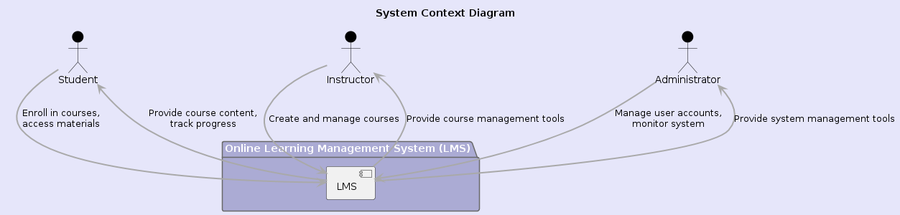
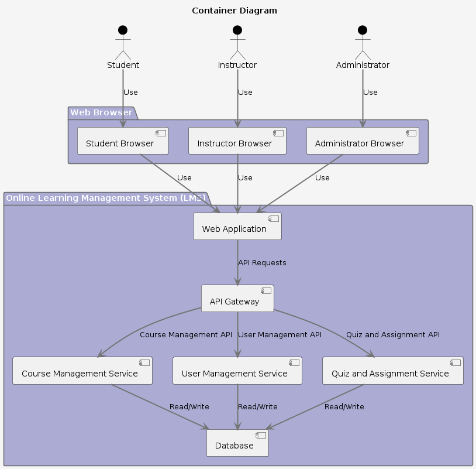
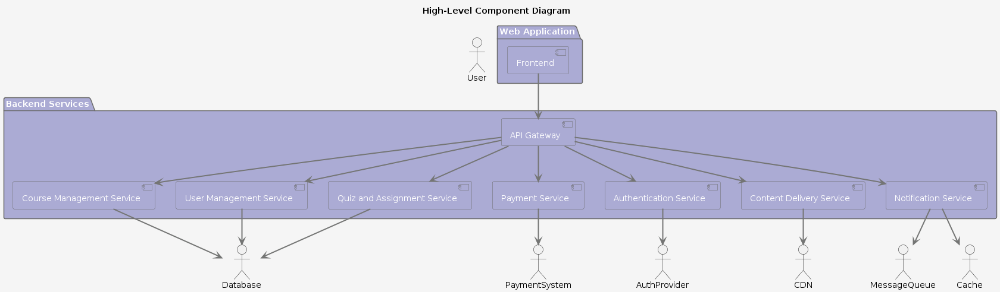
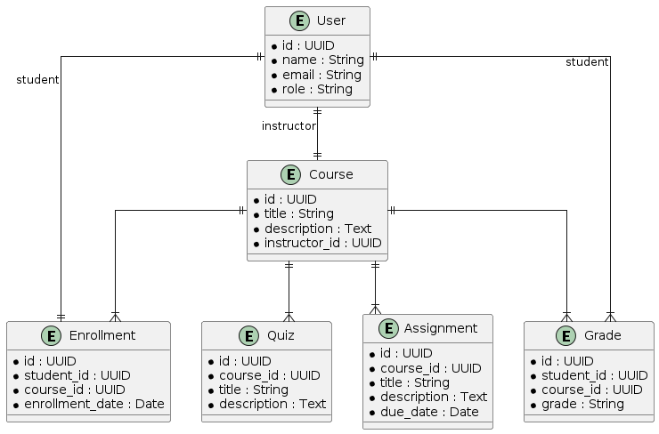

# Online Learning Management System (LMS) Design Document
 
## 1. Introduction
 
### 1.1 Purpose
The purpose of this design document is to provide a detailed description of the architecture and design of the Online Learning Management System (LMS). This document serves as a guide for developers to understand the system components, their interactions, and the rationale behind design decisions.
 
### 1.2 Scope
This document covers the overall system architecture, design patterns, data models, and user interfaces for the LMS. It is intended for software developers, system architects, and other stakeholders involved in the development and maintenance of the LMS.
 
### 1.3 Definitions, Acronyms, and Abbreviations
- **LMS**: Learning Management System
- **API**: Application Programming Interface
- **CDN**: Content Delivery Network
- **SSO**: Single Sign-On
- **UI**: User Interface
 
### 1.4 References
- [C4 Model for Software Architecture](https://c4model.com/)
- Project Charter Document
- Software Requirements Specification (SRS)
 
### 1.5 Overview
This document includes the design considerations, system architecture, data design, interface design, and other relevant sections necessary for understanding and implementing the LMS.
 
## 2. System Overview
 
The LMS is a web-based platform designed to facilitate the management of online courses. The system allows students to enroll in courses, access materials, participate in quizzes and assignments, and track their progress. Instructors can create and manage courses, upload materials, grade assignments, and monitor student progress. Administrators manage user accounts, permissions, and system performance.
 
## 3. Design Considerations
 
### 3.1 Assumptions and Dependencies
- Reliable internet connectivity is required for accessing the LMS.
- Users possess basic computer literacy.
- The system must comply with relevant data protection regulations (e.g., GDPR).
- Integration with existing authentication systems (e.g., SSO) is necessary.
 
### 3.2 Constraints
- The system must support a large number of concurrent users.
- The design must ensure data security and privacy.
- The system should be scalable and maintainable.
 
### 3.3 Goals and Guidelines
- **Usability**: The system should have an intuitive and user-friendly interface.
- **Performance**: The system should load pages within 3 seconds under normal conditions.
- **Security**: User data must be encrypted in transit and at rest.
- **Reliability**: The system should have an uptime of 99.9%.
 
## 4. System Architecture
 
### 4.1 Overview
The system architecture follows the C4 model, which includes context, container, and component diagrams. The architecture is designed to be modular, scalable, and secure.
 
### 4.2 Context Diagram

 
### 4.3 Container Diagram

 
### 4.4 Component Diagram (High-Level)

 
## 5. Data Design
 
### 5.1 Data Model
The LMS data model includes entities such as Users, Courses, Enrollments, Quizzes, Assignments, and Grades. The relationships between these entities are managed through a relational database.
 
### 5.2 Entity-Relationship Diagram

 
## 6. Interface Design
 
### 6.1 User Interface
The user interface for the LMS will be designed to be intuitive and easy to use. Key interfaces include the student dashboard, instructor dashboard, course management screens, and administrative panels.
 
### 6.2 API Design
The API will follow RESTful principles and provide endpoints for managing courses, users, quizzes, assignments, and other entities. Authentication and authorization will be handled using JWT tokens.
 
#### Example API Endpoints
- `GET /courses`
- `POST /courses`
- `GET /users`
- `POST /users`
- `POST /auth/login`
 
## 7. Detailed Design
 
### 7.1 Frontend Design
The frontend will be built using modern JavaScript frameworks such as React or Angular. It will communicate with the backend through RESTful APIs.
 
### 7.2 Backend Design
The backend will be built using a microservices architecture, with each service responsible for a specific domain (e.g., Course Management, User Management). Services will be developed using Node.js or a similar framework and will communicate through an API Gateway.
 
### 7.3 Database Design
The database will be a relational database such as PostgreSQL or MySQL. It will store all data related to users, courses, quizzes, assignments, and grades. Database operations will be optimized for performance and scalability.
 
## 8. Security Design
 
### 8.1 Authentication
Authentication will be handled using Single Sign-On (SSO) and JWT tokens. External authentication providers (e.g., Google, Facebook) will be supported.
 
### 8.2 Authorization
Role-based access control (RBAC) will be implemented to manage user permissions. Only authorized users will have access to specific functionalities.
 
### 8.3 Data Protection
Data will be encrypted both in transit (using HTTPS) and at rest. Regular security audits and penetration testing will be conducted to identify and mitigate vulnerabilities.
 
## 9. Conclusion
 
This design document provides a detailed overview of the architecture and design of the Online Learning Management System (LMS). It covers the system architecture, data design, interface design, and security considerations. This document serves as a guide for developers to implement and maintain the LMS effectively.
 
---
 
## Appendix
 
### A. Glossary
- **LMS**: Learning Management System
- **API**: Application Programming Interface
- **CDN**: Content Delivery Network
- **SSO**: Single Sign-On
- **UI**: User Interface
 
### B. References
- [C4 Model for Software Architecture](https://c4model.com/)
- Project Charter Document
- Software Requirements Specification (SRS)
- SWEBOK
